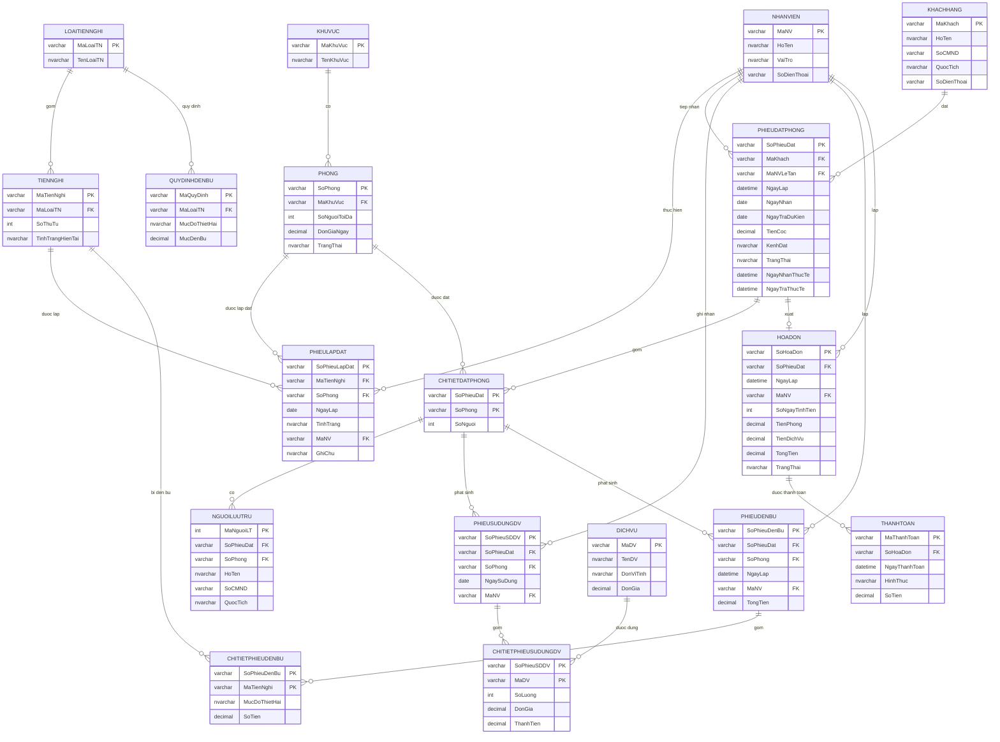

# LAB3 - Hệ thống Quản lý Khách sạn (QuanLyHotel)

Bài tập môn OOSD . Ứng dụng WinForms (C#, .NET Framework) kết nối
SQL Server, quản lý nghiệp vụ khách sạn: đặt phòng, tiện nghi, dịch vụ, trả
phòng - hóa đơn - thanh toán, đền bù thiệt hại và thống kê.

- **Tên project Visual Studio:** `QuanLyHotel`
- **Tên CSDL SQL Server:** `QuanLyHotelDB`

## 1. Sơ đồ ERD (Entity-Relationship Diagram)



**Giải thích thiết kế:**
- `KhuVuc` (1-n) `Phong`: mỗi khu vực có nhiều phòng, mỗi phòng thuộc 1 khu vực.
- `LoaiTienNghi` (1-n) `TienNghi`: mỗi loại tiện nghi (điều hòa, tivi...) có nhiều thiết bị cụ thể.
- `PhieuLapDat` là bảng giao (n-n) giữa `TienNghi` và `Phong`, có ràng buộc UNIQUE(MaTienNghi, NgayLap) để 1 thiết bị/1 ngày chỉ lắp 1 lần.
- `PhieuDatPhong` (1-n) `ChiTietDatPhong` (n-n) `Phong`: 1 phiếu đặt có thể đặt nhiều phòng.
- `NguoiLuuTru`, `PhieuSuDungDV`, `PhieuDenBu` đều tham chiếu tới khóa phức hợp `(SoPhieuDat, SoPhong)` của `ChiTietDatPhong` để biết chính xác người ở/dịch vụ/đền bù thuộc phòng nào trong phiếu đặt nào.
- `PhieuDatPhong` (1-1) `HoaDon`: mỗi phiếu đặt khi trả phòng sinh ra đúng 1 hóa đơn (`UNIQUE` trên `SoPhieuDat`).
- `HoaDon` (1-n) `ThanhToan`: hỗ trợ thanh toán nhiều lần/nhiều hình thức cho 1 hóa đơn.

## 2. Kiến trúc ứng dụng

```
QuanLyHotel/
├── Program.cs               
├── App.config                
├── Data/
│   └── DbHelper.cs            
├── Services/                  
│   ├── DanhMucService.cs
│   ├── PhongTienNghiService.cs
│   ├── DatPhongService.cs
│   ├── DichVuService.cs
│   ├── TraPhongService.cs
│   └── ThongKeService.cs
└── Forms/                     
    ├── FrmMain.cs
    ├── FrmDanhMuc.cs
    ├── FrmPhongTienNghi.cs
    ├── FrmDatPhong.cs
    ├── FrmDichVu.cs
    ├── FrmTraPhong.cs
    └── FrmThongKe.cs
```
## 3. Danh sách 6 Form nghiệp vụ (+ 1 Form chính)

| Form | Chức năng |
|---|---|
| FrmMain | Form chính (MDI), menu điều hướng tới 6 form còn lại |
| FrmDanhMuc | Quản lý Khu vực, Nhân viên, Loại tiện nghi, Dịch vụ, Quy định đền bù |
| FrmPhongTienNghi | Quản lý Phòng, Tiện nghi, Phiếu lắp đặt tiện nghi |
| FrmDatPhong | Quản lý Khách hàng, tìm phòng trống, lập phiếu đặt phòng, nhận phòng (check-in) |
| FrmDichVu | Lập phiếu sử dụng dịch vụ cho phòng đang ở |
| FrmTraPhong | Trả phòng, tính tiền, lập hóa đơn, thanh toán, lập phiếu đền bù thiệt hại |
| FrmThongKe | Báo cáo: doanh thu theo tháng, công suất phòng, dịch vụ bán chạy, thống kê đền bù |

## 4. Hướng dẫn cài đặt & chạy
1. Chạy script `SQL/QuanLyHotelDB.sql` trên SQL Server (SSMS) để tạo CSDL `QuanLyHotelDB`.
2. Kiểm tra/sửa chuỗi kết nối trong `App.config` cho đúng tên SQL Server instance của máy bạn (mặc định là `.\SQLEXPRESS`).
3. Đặt `Program.cs` làm Startup object, nhấn **Start (F5)**.

## 5. Công nghệ sử dụng
- C# WinForms (.NET Framework 4.7.2)
- SQL Server (ADO.NET - `System.Data.SqlClient`)
- Visual Studio 2022

## 6. Tác giả    
LAB3 - Môn OOSD - Trần Thiện Nhân

